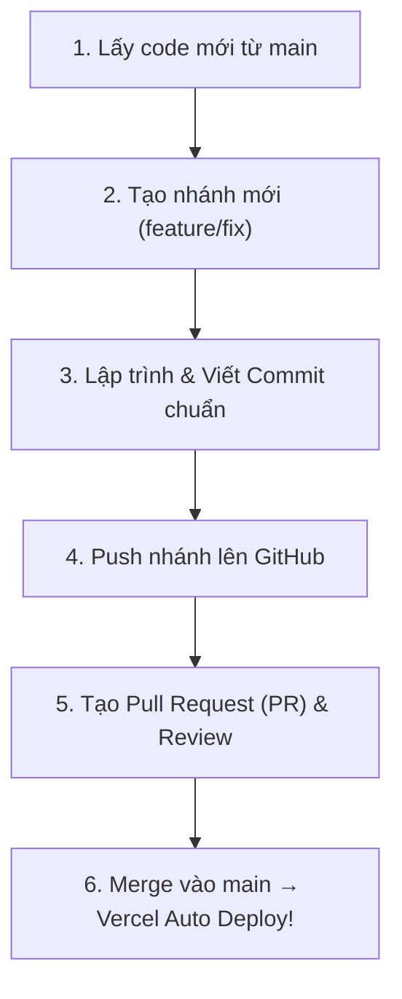

# 🌿 Quy Trình Làm Việc Với Git: Commit → Push → Merge (Git Workflow Guidelines)

> **Dành cho dự án**: VIETY COFFEE — CRM & ERP System  
> **Mục tiêu**: Chuẩn hóa quy trình phát triển mã nguồn, quản lý nhánh (Branch), commit chuẩn mực và hợp nhất code (Merge) an toàn mà không làm gãy hệ thống đang chạy trên Vercel.

---

## 🏗️ 1. Mô Hình Nhánh (Branch Strategy)

Hệ thống áp dụng mô hình **Git Feature Branch Workflow**:

| Tên Nhánh (Branch) | Mục đích sử dụng | Quy định bảo vệ |
| :--- | :--- | :--- |
| **`main`** | Nhánh sản phẩm chính thức (Production). Tự động deploy lên Vercel live `viety-coffee-fe.vercel.app`. | **Chỉ nhận code thông qua Pull Request (PR)** sau khi đã được kiểm thử sạch lỗi build. |
| **`feature/<tên-tính-năng>`** | Nhánh phát triển tính năng mới (Ví dụ: `feature/them-export-excel`, `feature/giao-dien-darkmode`). | Đưa lên review trước khi merge vào `main`. |
| **`fix/<tên-lỗi>`** | Nhánh sửa lỗi cấp bách (Ví dụ: `fix/loi-ngon-ngu-badge`, `fix/syntax-tsconfig`). | Sửa xong tạo PR merge thẳng vào `main`. |
| **`refactor/<nhiệm-vụ>`** | Nhánh tối ưu hóa code, cấu trúc lại thư mục mà không đổi tính năng. | Cần test kỹ trước khi merge. |

---

## 🔄 2. Quy Trình 4 Bước Chuẩn Chỉnh (Daily Workflow)



---

### 📌 BƯỚC 1: Lấy Code Mới Nhất & Tạo Nhánh (Create Branch)

Trước khi bắt tay làm tính năng mới, luôn đảm bảo bạn đang ở nhánh `main` và có code mới nhất:

```bash
# 1. Chuyển về nhánh main
git checkout main

# 2. Cập nhật code mới nhất từ Server
git pull origin main

# 3. Tạo nhánh mới và chuyển sang nhánh đó luôn
git checkout -b feature/tên-tính-năng-mới
# Ví dụ: git checkout -b feature/them-bieu-do-dashboard
# Ví dụ: git checkout -b fix/loi-nut-export-excel
```

---

### 📌 BƯỚC 2: Commit Code Theo Quy Chuẩn (Conventional Commits)

Khi code xong một phần tính năng, hãy kiểm tra và commit code.

#### A. Kiểm tra trước khi Commit:
```bash
# Xem các file đã chỉnh sửa
git status

# Chạy kiểm tra biên dịch xem có bị lỗi TypeScript không
npm run build
```

#### B. Thêm file và viết thông điệp Commit:
Định dạng Commit chuẩn: `<type>(<scope>): <thông điệp môt tả ngắn gọn>`

```bash
# Thêm file vào vùng chờ (Staging)
git add .

# Tạo commit với thông điệp rõ ràng
git commit -m "feat(dashboard): thêm biểu đồ doanh thu Recharts 6 tháng"
```

#### 💡 Bảng phân loại tiền tố Commit (Commit Types):
- **`feat:`** (Feature) — Thêm tính năng mới *(VD: `feat(orders): thêm nút xuất Excel`)*
- **`fix:`** (Bugfix) — Sửa lỗi tính năng/giao diện *(VD: `fix(badge): sửa lỗi rớt dòng tag trạng thái`)*
- **`style:`** (UI/CSS) — Chỉnh sửa giao diện, màu sắc, font chữ không đổi logic
- **`refactor:`** (Refactoring) — Cấu trúc lại code cho sạch đẹp
- **`docs:`** (Documentation) — Thêm/sửa tài liệu Hướng dẫn, README
- **`chore:`** (Maintenance) — Cập nhật cấu hình, cài đặt thư viện npm

---

### 📌 BƯỚC 3: Push Nhánh Lên GitHub (Push Branch)

Sau khi commit xong ở máy cá nhân (Local), đẩy nhánh đó lên GitHub:

```bash
# Lần đầu tiên đẩy nhánh mới lên GitHub
git push -u origin feature/tên-tính-năng-mới

# Những lần push tiếp theo trên cùng nhánh đó chỉ cần:
git push
```

---

### 📌 BƯỚC 4: Tạo Pull Request (PR) & Merge Vào `main`

1. Truy cập vào GitHub Repository: [github.com/NhwTaho/FE](https://github.com/NhwTaho/FE)
2. Bạn sẽ thấy thông báo màu vàng: **"feature/... had recent pushes"** → Bấm nút **Compare & pull request**.
3. Điền mô tả ngắn gọn công việc đã làm trong PR.
4. Bấm **Create pull request**.
5. Sau khi review ổn thỏa:
   - Bấm nút **Merge pull request** → **Confirm merge**.
   - **Vercel sẽ tự động bắt sự kiện Merge và Deploy lên `https://viety-coffee-fe.vercel.app` ngay lập tức!**

6. **Dọn dẹp sau khi Merge xong**:
   ```bash
   # Chuyển về main local
   git checkout main
   
   # Cập nhật code mới nhất vừa merge
   git pull origin main
   
   # Xóa nhánh feature cũ dưới máy local cho gọn
   git branch -d feature/tên-tính-năng-mới
   ```

---

## ⚡ 3. Bảng Tra Cứu Lệnh Git Nhanh (Cheat Sheet)

| Nhu cầu thao tác | Câu lệnh Git tương ứng |
| :--- | :--- |
| **Xem trạng thái các file đổi** | `git status` |
| **Xem danh sách các nhánh** | `git branch -a` |
| **Chuyển sang nhánh khác** | `git checkout <tên-nhánh>` |
| **Tạo và chuyển nhánh mới** | `git checkout -b <tên-nhánh-mới>` |
| **Lấy code mới nhất về** | `git pull origin main` |
| **Hủy bỏ thay đổi chưa commit** | `git restore .` |
| **Hủy commit gần nhất (giữ lại code)** | `git reset --soft HEAD~1` |
| **Xem lịch sử các commit** | `git log --oneline -n 10` |

---

## 🚨 4. Nguyên Tắc Vàng Giúp Dự Án An Toàn (Best Practices)

1. ❌ **KHÔNG** push code trực tiếp lên `main` khi làm tính năng phức tạp (luôn tạo nhánh riêng).
2. ⚠️ **LUÔN** chạy `npm run build` ở local trước khi commit để đảm bảo code không bị lỗi gãy build Vercel.
3. 🧹 **KHÔNG** commit các thư mục như `node_modules/`, `dist/`, `.env` (đã được chặn sẵn trong `.gitignore`).
4. 💬 Thông điệp Commit phải có ý nghĩa, phản ánh đúng công việc đã làm (Tránh đặt commit dạng `fix lỗi`, `update1`, `asdfg`).

---

> ✏️ *Tài liệu Quy trình Git được biên soạn cho dự án VIETY COFFEE FE.*
